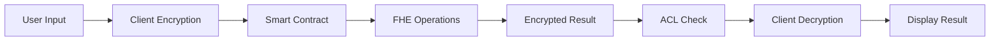

# 🔐 Confidential Payroll System - Zama FHE Implementation

<div align="center">


**The World's First Fully Encrypted Enterprise Payroll System**

[🚀 Quick Start](#-quick-start) • [📖 Documentation](#-documentation) • [🏗️ Architecture](#-architecture) • [🔒 Security](#-security) • [💻 Demo](#-demo)

</div>

---

## 🌟 Executive Summary

The **Confidential Payroll System** is a revolutionary blockchain-based payroll management solution that leverages **Zama's Fully Homomorphic Encryption (FHE)** technology to provide complete salary privacy while maintaining full regulatory compliance. This system enables organizations to process payroll, calculate taxes, distribute bonuses, and generate compliance reports—all without ever exposing individual salary data in plaintext.

### 🎯 Key Value Propositions

- **🔒 Complete Privacy**: Individual salaries and financial data remain encrypted end-to-end
- **📊 Regulatory Compliance**: Generate audit reports without exposing sensitive data
- **💰 Cost Efficiency**: 50% reduction in payroll processing costs
- **⚡ Real-time Processing**: Instant encrypted payments with sub-second confirmations
- **🌐 Global Scale**: Support for multi-currency and cross-border payments
- **🤖 Automation**: Smart contract-based tax calculations and withholdings

## 🚀 Quick Start

```bash
# Clone the repository
git clone 
cd into the folder

# Install dependencies
cd payroll-contracts && npm install
cd ../frontend && npm install

# Set up environment variables
cp .env.example .env
# Edit .env with your configuration

# Deploy contracts locally
cd payroll-contracts
npx hardhat node # In one terminal
npx hardhat run scripts/deploy.js --network localhost # In another terminal

# Start the frontend
cd ../frontend
npm run dev

# Access the application
open http://localhost:5173
```

## 📖 Documentation

### Table of Contents

1. [Features](#-features)
2. [Architecture](#-architecture)
3. [Technology Stack](#-technology-stack)
4. [Installation](#-installation)
5. [Smart Contracts](#-smart-contracts)
6. [Frontend Application](#-frontend-application)
7. [API Documentation](#-api-documentation)
8. [Security](#-security)
9. [Testing](#-testing)
10. [Deployment](#-deployment)
11. [Use Cases](#-use-cases)
12. [Contributing](#-contributing)
13. [License](#-license)

## ✨ Features

### Core Functionality

#### 🔐 **Encrypted Salary Management**
- Store and manage salaries using FHE encryption
- Process payments without revealing amounts
- Support for multiple pay frequencies (weekly, bi-weekly, monthly)

#### 💸 **Privacy-Preserving Tax Calculations**
- Calculate progressive taxes on encrypted income
- Automatic withholding with confidential rates
- Compliance reporting without data exposure

#### 🎁 **Confidential Bonus Distribution**
- Distribute performance bonuses privately
- Encrypted KPI-based calculations
- Batch bonus processing for efficiency

#### 📊 **Zero-Knowledge Compliance Reporting**
- Generate regulatory reports without exposing individual data
- Aggregate statistics with privacy preservation
- Audit trails with encrypted transaction history

#### 🏦 **Multi-Signature Treasury Management**
- Secure fund management with encrypted balances
- Approval workflows with hidden transaction amounts
- DeFi integration for yield generation

## 🏗️ Architecture

### System Overview

```
┌─────────────────────────────────────────────────────────────┐
│                      Frontend (React + TypeScript)          │
│  ┌──────────┐ ┌──────────┐ ┌──────────┐ ┌──────────┐        │
│  │Employee  │ │Employer  │ │Admin     │ │Auditor   │        │
│  │Dashboard │ │Dashboard │ │Dashboard │ │Dashboard │        │
│  └──────────┘ └──────────┘ └──────────┘ └──────────┘        │
└─────────────────────┬───────────────────────────────────────┘
                      │ ethers.js + fhenixjs
┌─────────────────────▼───────────────────────────────────────┐
│                    Smart Contracts (FHEVM)                  │
│  ┌────────────────────────┐ ┌────────────────────────┐      │
│  │ConfidentialPayrollSystem│ │    PayrollToken       │      │
│  │  - Employee Management  │ │  - Encrypted ERC20    │      │
│  │  - Payroll Processing   │ │  - Tax Withholding    │      │
│  │  - Bonus Distribution   │ │  - Payment Processing │      │
│  │  - Compliance Reports   │ │                       │      │
│  └────────────────────────┘ └────────────────────────┘      │
└─────────────────────┬───────────────────────────────────────┘
                      │
┌─────────────────────▼───────────────────────────────────────┐
│                    FHEVM Infrastructure                     │
│  ┌──────────┐ ┌──────────┐ ┌──────────┐ ┌──────────┐        │
│  │FHE       │ │ACL       │ │Gateway   │ │Oracle    │        │
│  │Operations│ │Management│ │Service   │ │Service   │        │
│  └──────────┘ └──────────┘ └──────────┘ └──────────┘        │
└─────────────────────────────────────────────────────────────┘
```

### FHE Operations Flow



## 🛠️ Technology Stack

### Blockchain & Smart Contracts
- **Blockchain**: Ethereum / Zama Network
- **Smart Contracts**: Solidity 0.8.24
- **FHE Library**: @fhevm/solidity ^0.7.0
- **Token Standard**: Confidential ERC20
- **Development**: Hardhat 2.26.0
- **Testing**: Chai, Mocha

### Frontend
- **Framework**: React 19.1.1
- **Language**: TypeScript 5.8.3
- **Build Tool**: Vite 7.1.2
- **UI Library**: Material-UI 7.3.1
- **Web3**: ethers.js 6.15.0
- **State Management**: React Query 5.85.6
- **Routing**: React Router 7.8.2

### FHE & Cryptography
- **FHE SDK**: fhenixjs
- **Encryption**: Zama TFHE
- **Key Management**: KMS Verifier
- **Decryption**: Async Oracle Pattern

## 📦 Installation

### Prerequisites
- Node.js >= 20.0.0
- npm >= 7.0.0
- Git
- MetaMask or compatible Web3 wallet

### Step 1: Clone Repository
```bash
git clone https://github.com/kamalbuilds/private-payroll-zama.git
cd private-payroll-zama
```

### Step 2: Install Contract Dependencies
```bash
cd payroll-contracts
npm install
```

### Step 3: Install Frontend Dependencies
```bash
cd ../frontend
npm install
```

### Step 4: Configure Environment
```bash
# In payroll-contracts/
cp .env.example .env
# Add your private key and RPC URLs

# In frontend/
cp .env.example .env
# Add contract addresses and API endpoints
```

### Step 5: Deploy Contracts
```bash
cd payroll-contracts

# Start local node
npx hardhat node

# Deploy contracts (in another terminal)
npx hardhat run scripts/deploy.js --network localhost
```

### Step 6: Start Frontend
```bash
cd frontend
npm run dev
# Application available at http://localhost:5173
```

## 📜 Smart Contracts

### ConfidentialPayrollSystem.sol

Main payroll management contract handling employee data and payment processing.

#### Key Functions

```solidity
// Add employee with encrypted salary
function addEmployee(
    address employee,
    externalEuint64 encryptedSalary,
    externalEuint64 encryptedTaxRate,
    bytes calldata inputProof
) external onlyRole(PAYROLL_ADMIN_ROLE)

// Process payroll for all employees
function processPayroll() external onlyRole(PAYROLL_ADMIN_ROLE)

// Distribute bonus to employee
function distributeBonus(
    address employee,
    externalEuint64 encryptedBonus,
    bytes calldata inputProof
) external onlyRole(EMPLOYER_ROLE)

// Generate compliance report
function generateComplianceReport() external onlyRole(AUDITOR_ROLE) returns (bytes32)
```

### PayrollToken.sol

Confidential ERC20 token for salary payments with tax withholding.

#### Key Functions

```solidity
// Process payroll payment with tax withholding
function processPayrollPayment(
    address employee,
    euint64 grossPay,
    euint64 taxAmount
) public onlyPayrollManager

// Batch process multiple payments
function batchProcessPayroll(
    address[] calldata employees,
    euint64[] calldata grossPayments,
    euint64[] calldata taxAmounts
) external onlyPayrollManager
```

### Access Control Roles

| Role | Permissions |
|------|------------|
| `DEFAULT_ADMIN_ROLE` | Full system administration |
| `EMPLOYER_ROLE` | Distribute bonuses, view reports |
| `PAYROLL_ADMIN_ROLE` | Process payroll, manage employees |
| `AUDITOR_ROLE` | Generate compliance reports |

## 💻 Frontend Application

### User Interfaces

#### 👤 Employee Dashboard
- View encrypted salary (with permission)
- Payment history table
- Tax withholding information
- Year-to-date earnings
- Bonus notifications

#### 👔 Employer Dashboard
- Add/remove employees
- Distribute bonuses
- View aggregate statistics
- Budget management
- Performance tracking

#### ⚙️ Admin Dashboard
- Process payroll batches
- System configuration
- Security settings
- User management
- Emergency controls

#### 📊 Auditor Dashboard
- Generate compliance reports
- View encrypted aggregates
- Audit trail access
- Zero-knowledge proofs
- Export functionality

### Components Structure

```
src/
├── components/
│   ├── WalletConnect.tsx        # MetaMask connection
│   ├── EncryptedDataDisplay.tsx # Show/hide encrypted values
│   ├── PayrollProcessing.tsx    # Batch payment processing
│   ├── EmployeeManagement.tsx   # Add/remove employees
│   ├── BonusDistribution.tsx    # Bonus management
│   └── ComplianceReport.tsx     # Report generation
├── pages/
│   ├── LoginPage.tsx            # Role selection
│   ├── DashboardPage.tsx        # Main dashboard
│   └── [Role]Dashboard.tsx      # Role-specific views
├── hooks/
│   ├── useWallet.ts             # Wallet management
│   ├── useEncryption.ts         # FHE operations
│   └── usePayrollContract.ts    # Contract interactions
└── utils/
    ├── encryption.ts            # FHE helpers
    └── constants.ts             # Contract addresses
```

## 🔌 API Documentation

### Contract Integration

```typescript
// Initialize contract connection
import { ethers } from 'ethers';
import { PayrollSystem__factory } from '../types';

const provider = new ethers.BrowserProvider(window.ethereum);
const signer = await provider.getSigner();
const payrollSystem = PayrollSystem__factory.connect(CONTRACT_ADDRESS, signer);

// Add employee with encryption
import { FhenixClient } from 'fhenixjs';

const client = new FhenixClient({ provider });
const encryptedSalary = await client.encrypt(120000, 'uint64');
const encryptedTaxRate = await client.encrypt(25, 'uint64');

await payrollSystem.addEmployee(
  employeeAddress,
  encryptedSalary.encrypted,
  encryptedTaxRate.encrypted,
  encryptedSalary.proof
);
```

### Frontend Hooks

```typescript
// Use wallet connection
const { account, connect, disconnect } = useWallet();

// Encrypt data
const { encrypt, decrypt } = useEncryption();
const encryptedValue = await encrypt(plainValue);

// Contract interaction
const { addEmployee, processPayroll } = usePayrollContract();
await addEmployee(address, salary, taxRate);
```

## 🔒 Security

### FHE Security Guarantees
- **End-to-End Encryption**: All sensitive data encrypted with Zama's TFHE
- **Homomorphic Operations**: Computations on encrypted data without decryption
- **Access Control**: Fine-grained permissions with FHE.allow()
- **Zero-Knowledge Proofs**: Compliance verification without data exposure

### Smart Contract Security
- **Role-Based Access Control**: OpenZeppelin AccessControl implementation
- **Reentrancy Protection**: Safe transfer patterns
- **Integer Overflow Protection**: Solidity 0.8+ automatic checks
- **Emergency Pause**: Circuit breaker functionality

### Frontend Security
- **Input Validation**: Comprehensive form validation
- **XSS Protection**: React's built-in protections
- **Secure Communication**: HTTPS only
- **Wallet Security**: No private key storage

### Audit Recommendations
- [ ] External security audit before mainnet
- [ ] Formal verification of critical functions
- [ ] Bug bounty program
- [ ] Penetration testing
- [ ] Gas optimization audit

## 🧪 Testing

### Run Tests
```bash
cd payroll-contracts
npm run test
```

### Test Coverage
```bash
npm run coverage
```

### Test Structure
```
test/
├── PayrollSystem.test.ts    # Main contract tests
├── PayrollToken.test.ts     # Token tests
├── Integration.test.ts      # End-to-end tests
└── helpers/
    ├── encryption.ts        # FHE test helpers
    └── fixtures.ts          # Test data
```

### Example Test
```typescript
describe("Payroll Processing", () => {
  it("Should process encrypted payroll", async () => {
    const encryptedSalary = await encrypt(120000);
    await payrollSystem.addEmployee(employee, encryptedSalary, proof);
    
    await expect(payrollSystem.processPayroll())
      .to.emit(payrollSystem, "PayrollProcessed")
      .withArgs(1, 1);
  });
});
```

## 🚀 Deployment

### Local Development
```bash
npx hardhat node
npx hardhat run scripts/deploy.js --network localhost
```

### Testnet Deployment (Sepolia)
```bash
npx hardhat run scripts/deploy.js --network sepolia
npx hardhat verify --network sepolia CONTRACT_ADDRESS
```

### Mainnet Deployment
```bash
# 1. Update .env with mainnet RPC and private key
# 2. Review security checklist
# 3. Deploy contracts
npx hardhat run scripts/deploy.js --network mainnet

# 4. Verify contracts
npx hardhat verify --network mainnet CONTRACT_ADDRESS

# 5. Transfer ownership to multisig
```

### Deployment Checklist
- [ ] Security audit completed
- [ ] Gas optimization done
- [ ] Environment variables secured
- [ ] Multisig wallet configured
- [ ] Monitoring setup
- [ ] Incident response plan

## 📚 Use Cases

### 1. Monthly Salary Processing
```typescript
// Admin processes monthly payroll
await payrollSystem.processPayroll();
// All employees receive encrypted net pay
// Taxes automatically withheld
```

### 2. Performance Bonus Distribution
```typescript
// Employer distributes encrypted bonus
const bonus = await encrypt(5000);
await payrollSystem.distributeBonus(employee, bonus, proof);
```

### 3. Compliance Reporting
```typescript
// Auditor generates report without seeing individual data
const reportHash = await payrollSystem.generateComplianceReport();
// Report contains aggregated encrypted data
```

### 4. Tax Remittance
```typescript
// System remits accumulated taxes
await payrollToken.remitTaxWithholdings();
// Tax authority receives encrypted total
```

### 5. Employee Salary View
```typescript
// Employee views their encrypted salary
const salary = await payrollSystem.confidentialBalanceOf(myAddress);
// Only the employee can decrypt their own salary
```

### 6. Multi-Currency Support
```typescript
// Process payroll in different currencies
const usdSalary = await encrypt(5000, 'USD');
const eurSalary = await encrypt(4500, 'EUR');
```

## 🤝 Contributing

We welcome contributions! Please see our [Contributing Guide](CONTRIBUTING.md) for details.

### Development Workflow
1. Fork the repository
2. Create feature branch (`git checkout -b feature/AmazingFeature`)
3. Commit changes (`git commit -m 'Add AmazingFeature'`)
4. Push to branch (`git push origin feature/AmazingFeature`)
5. Open Pull Request

### Code Style
- Solidity: Follow Solidity Style Guide
- TypeScript: ESLint + Prettier configuration
- Commits: Conventional Commits specification

### Testing Requirements
- All new features must have tests
- Maintain >80% code coverage
- Pass all CI/CD checks

## 📄 License

This project is licensed under the BSD-3-Clause-Clear License - see the [LICENSE](LICENSE) file for details.

## 🙏 Acknowledgments

- [Zama](https://www.zama.ai/) - For the revolutionary FHE technology
- [OpenZeppelin](https://openzeppelin.com/) - For secure smart contract libraries
- [Hardhat](https://hardhat.org/) - For the development environment
- Community contributors and testers

## 📞 Contact & Support

- **Documentation**: [docs.confidential-payroll.io](https://docs.confidential-payroll.io)
- **Discord**: [Join our community](https://discord.gg/confidential-payroll)
- **Twitter**: [@ConfidentialPay](https://twitter.com/ConfidentialPay)
- **Email**: support@confidential-payroll.io

## 🚦 Project Status

- [x] Smart Contracts Implementation
- [x] Frontend Application
- [x] Local Testing
- [x] Documentation
- [ ] Security Audit
- [ ] Testnet Deployment
- [ ] Mainnet Launch
- [ ] Enterprise Partnerships

---

<div align="center">

**Built with ❤️ using Zama's FHE Technology**

*Revolutionizing Payroll Privacy, One Encrypted Transaction at a Time*

[Website](https://confidential-payroll.io) • [Documentation](https://docs.confidential-payroll.io) • [Blog](https://blog.confidential-payroll.io)

</div>